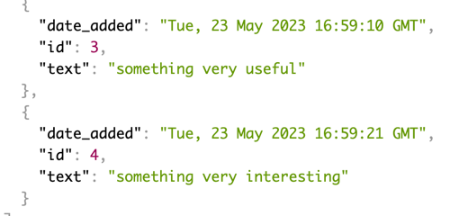

# A simple REST-based Flask application to work with the database

This tutorial provides a description and instructions for using a simple REST application on Flask that provides database functionality. The application allows you to perform read, add, update and delete operations on data.

## Routes and domains
### 1. Getting all data
Method: GET
URL: http://localhost:5000/notes

Description: Gets all data from the database.

Example response:

---
### 2. Adding new data
Method: POST
URL: http://localhost:5000/add

Description: Adds new data to the database.

Request body: JSON object with a text field to specify the title and content of the note.

Example request:

---
### 3. changing data
Method: PUT
URL: http://localhost:5000/notes/{id}

Description: Changes the data in the database for the specified id.

Request body: JSON object with title and content fields to specify the new title and content of the note.

Example request:

---
### 4. Deleting data
Method: DELETE
URL: http://localhost:5000/delete/{id}

Description: Deletes data from the database for the specified id.

Example request:
